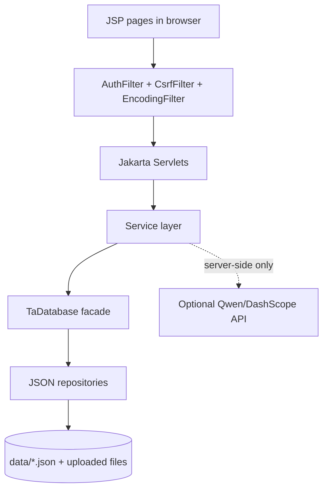

<div align="center">

# QM HIRE

**Teaching Assistant Recruitment Platform**

*EBU6304 Software Engineering · BUPT × Queen Mary University of London · Group 105 · 2025–2026*

<br>

[](https://openjdk.org/)
[](https://maven.apache.org/)
[](https://tomcat.apache.org/)
[](#development-and-verification)
[](#academic-use)

<br>

[Overview](#overview) · [Team](#team) · [Features](#features) · [Architecture](#architecture) · [Quick Start](#quick-start) · [Documentation](#documentation)

</div>

---

## Team

**Software Engineering Group 105** · BUPT × QMUL Joint Programme

| Member | QM ID | BUPT ID | Contact |
|:--|:--|:--|:--|
| **Wanran Sun** | 231223254 | 2023213626 | 112358wan@gmail.com |
| **Xiankun Jiang** | 231223542 | 2023213655 | jp2023213655@qmul.ac.uk |
| **Siyuan Xue** | 231223564 | 2023213657 | jp2023213657@qmul.ac.uk |
| **Yutong Wu** | 231223575 | 2023213658 | serovia@126.com |
| **Xiaoxiao Ma** | 231223715 | 2023213672 | maxiaoxiao@bupt.edu.cn |
| **Rui Ma** | 231223151 | 2023213616 | 940874485@qq.com |

> **Course TA:** Wang Ruijia · `wang_ruijia@bupt.edu.cn`

---

## Overview

**QM HIRE** is a production-grade Java web application developed as the final deliverable for *EBU6304 Software Engineering*. The platform supports the full Teaching Assistant recruitment lifecycle — from vacancy discovery and application submission through review, offer management, workload monitoring, audit logging, and optional AI-assisted decision support.

<table>
<tr>
<td><strong>Artifact</strong></td>
<td><code>target/ta105.war</code></td>
<td><strong>Context path</strong></td>
<td><code>/ta105</code></td>
</tr>
<tr>
<td><strong>Runtime</strong></td>
<td>Java 17 · Maven · Apache Tomcat 11</td>
<td><strong>Web stack</strong></td>
<td>Jakarta Servlet 6 · JSP · JSTL · Tailwind CDN</td>
</tr>
<tr>
<td><strong>Persistence</strong></td>
<td>Jackson JSON files under <code>data/</code></td>
<td><strong>AI provider</strong></td>
<td>Alibaba DashScope Qwen (optional, rule-based fallback)</td>
</tr>
<tr>
<td><strong>Verification</strong></td>
<td colspan="3"><code>mvn test</code> — <strong>133 / 133</strong> tests passing (latest local run)</td>
</tr>
</table>

### Coursework Submission Alignment

The handout requires the final software ZIP to include source code, test programs, code documentation (JavaDocs), a user manual with key screenshots, and README setup/run instructions. This repository is organised to make those materials easy to inspect.

| Handout requirement | Project artifact |
|:--|:--|
| Source code | `src/main/java/`, `src/main/webapp/` |
| Test programs | `src/test/java/` |
| Code documentation | `mvn javadoc:javadoc` → `target/reports/apidocs/index.html` |
| User manual & deployment notes | `docs/07-user-deployment-and-maintenance.md` |
| Setup, configuration & run instructions | This README · `docs/README.md` |
| Final software ZIP | Submit as `Software_group105.zip` on QM+ |
| Final report | Submit separately as `Report_group105.pdf` |

> Before final GitHub review, push all local `main` commits so the remote repository reflects the latest software, tests, documentation, and README updates.

---

## Features

### Teaching Assistant

- Register and sign in as a TA applicant
- Browse, filter, and favourite published vacancies
- Create, upload, duplicate, edit, and delete resumes when permitted
- Bind resume skills with proficiency and years of experience
- Apply with an existing resume or a newly uploaded file; submitted files are snapshotted for MO review
- Track applications, withdraw pending applications, and accept or decline offers
- Optional AI assistance for resume review, vacancy matching, resume ranking, and cover-letter drafting (requires `QWEN_API_KEY`)
- Applicant-facing skill-gap feedback only; internal match scores and hiring recommendations are reserved for MO review

### Module Organiser

- Create, edit, draft, publish, and cancel vacancies
- Maintain vacancy metadata: labels, deadlines, job type, slots, start/end dates, and skill requirements
- Review applications through the intended workflow: start review → refresh match analysis → inspect applicant detail → download submitted resume → send offer or reject
- MO-only match analysis: rule score, AI/fallback score, final score, recommendation, explanation, skill coverage, missing required skills, and workload remaining hours
- Refresh match analysis only after the application has entered review
- Optional AI assistance for applicant ranking and offer/reject advice; final decisions remain human-controlled

### Administrator

- Manage TA, MO, and Admin users — create accounts, edit profiles, reset passwords, deactivate/reactivate non-admin users
- Manage the skills catalogue with reference protection for skills already used by resumes or job requirements
- Monitor accepted TA workloads: weekly hours, capacity, estimated income, and workload status
- View rule-based workload rebalance suggestions highlighting high-utilisation TAs and lower-load alternatives
- Search audit logs and export audit data as CSV

### Platform, Security & Reliability

| Concern | Implementation |
|:--|:--|
| Access control | Role-based workflows for TA, MO, and Admin |
| Session security | Session hardening on login with session ID rotation |
| CSRF protection | Global protection for all unsafe requests |
| File uploads | Extension, MIME type, file signature, and size validation |
| Password reset | Public reset no longer changes passwords directly; admins reset from Admin Users |
| AI governance | Explicit user consent; `AI_REQUEST` audit entries without storing prompts or full model outputs |
| Resilience | Core recruitment flows continue without Qwen via rule-based match analysis fallback |
| Persistence | JSON files through repository interfaces and the `TaDatabase` facade |

---

## Architecture

QM HIRE is deployed as a single WAR application on Tomcat. Browser requests pass through filters and servlets; business rules reside in the service layer; persistence is accessed through `TaDatabase` and JSON repositories. API keys are read server-side only and are never exposed to the browser.



**Key design decisions**

1. **JSON persistence** — satisfies the coursework no-external-database constraint; suitable for single-JVM demonstration.
2. **Application snapshots** — submitted resume files are preserved so MO review reflects the file at application time.
3. **Optional AI with guardrails** — consent, server-side validation, audit logging, and rule-based fallback.
4. **Comprehensive test coverage** — services, repositories, utilities, filters, security helpers, and key servlets.

---

## Quick Start

### Prerequisites

| Requirement | Version |
|:--|:--|
| JDK | 17 or later |
| Maven | 3.9 or later |
| Apache Tomcat | 11 |

### Build, Test & Generate Documentation

```bash
git clone <repository-url>
cd <project-folder>

mvn test
mvn clean package
mvn javadoc:javadoc
```

| Command | Expected output |
|:--|:--|
| `mvn test` | **133 / 133** tests passing |
| `mvn clean package` | `target/ta105.war` |
| `mvn javadoc:javadoc` | `target/reports/apidocs/index.html` |

### Deploy to Tomcat

1. Copy `target/ta105.war` to the Tomcat `webapps/` directory
2. Start or restart Tomcat 11
3. Open **http://localhost:8080/ta105/**
4. If Tomcat does not pick up a redeployed WAR, stop Tomcat and remove the exploded `webapps/ta105/` directory before restarting

### Run Locally

**Option A — Command-line Tomcat**

```bash
# 1. Build the WAR from the project root
mvn clean package

# 2. Copy the WAR to Tomcat (replace CATALINA_HOME with your Tomcat directory)
cp target/ta105.war "$CATALINA_HOME/webapps/ta105.war"

# 3. Optional: dedicated local data directory
export TA105_DATA_DIR="$PWD/data"

# 4. Start Tomcat
"$CATALINA_HOME/bin/startup.sh"

# 5. Open the application
open http://localhost:8080/ta105/
```

> **Windows:** use the same build command, copy `target\ta105.war` to `%CATALINA_HOME%\webapps\ta105.war`, run `%CATALINA_HOME%\bin\startup.bat`, then open http://localhost:8080/ta105/

**Option B — IntelliJ IDEA with local Tomcat**

1. Open this repository in IntelliJ IDEA (Project SDK: Java 17)
2. Create a Tomcat Server run configuration
3. Add the `ta105:war exploded` or `ta105.war` artifact
4. Set the application context to `/ta105`
5. Optionally set `TA105_DATA_DIR=<absolute-path-to-project>/data`
6. Start the configuration and open **http://localhost:8080/ta105/**

**Local run checklist**

- [ ] Login page opens at `/ta105/login`
- [ ] Demo accounts work after seeding (see below)
- [ ] Resume uploads written to `data/resumes/uploads/`
- [ ] Application snapshots written to `data/applications/submissions/`
- [ ] After redeploy, delete exploded `webapps/ta105/` if changes are not reflected

### Demo Accounts

When the configured `data/` directory is empty, the seeder creates demo accounts. Password for all accounts: **`password`**

| Role | Email |
|:--|:--|
| TA | `test@example.com` |
| MO | `mo@example.com` |
| Admin | `admin@example.com` |

### Data Directory

By default, runtime data is stored under `./data`. Override with:

```bash
export TA105_DATA_DIR=/absolute/path/to/data
# or JVM property:
-Dta105.data.dir=/absolute/path/to/data
```

| Path | Contents |
|:--|:--|
| `data/*.json` | JSON database files |
| `data/resumes/uploads/` | Resume uploads |
| `data/applications/submissions/` | Application submission snapshots |

Seeder data is created only when all business tables are empty. To reset a demo: stop Tomcat → back up `data/` → clear business JSON files → restart.

---

## Optional AI Configuration

AI features use Qwen/DashScope and are **optional**. Without `QWEN_API_KEY`, direct Qwen buttons are disabled and persisted match analysis still works through rule-based fallback.

| Variable | Required | Description |
|:--|:--|:--|
| `QWEN_API_KEY` | Yes (for direct AI calls) | DashScope API key |
| `QWEN_MODEL` | No | Vision/multimodal resume model |
| `QWEN_TEXT_MODEL` | No | Text model for ranking, matching, and drafting |

**Windows** — Tomcat `bin/setenv.bat`:

```bat
set "QWEN_API_KEY=sk-your-key-here"
```

**Linux / macOS:**

```bash
export QWEN_API_KEY=sk-your-key-here
```

For consent rules, fallback behaviour, and troubleshooting, see `docs/06-risk-security-and-ai-ethics.md` and `docs/07-user-deployment-and-maintenance.md`.

---

## Documentation

| Document | Purpose |
|:--|:--|
| [`docs/README.md`](docs/README.md) | Final coursework documentation index |
| [`docs/01-requirements-and-user-stories.md`](docs/01-requirements-and-user-stories.md) | Requirements, user stories, acceptance criteria, traceability |
| [`docs/02-analysis-models.md`](docs/02-analysis-models.md) | EBC analysis, use case, domain, ER, and activity diagrams |
| [`docs/03-architecture-and-design.md`](docs/03-architecture-and-design.md) | 4+1 architecture, component/package/deployment diagrams, sequences, state, SOLID, patterns |
| [`docs/04-implementation-and-code-quality.md`](docs/04-implementation-and-code-quality.md) | Implementation conventions, security coding rules, persistence quality |
| [`docs/05-testing-and-quality-assurance.md`](docs/05-testing-and-quality-assurance.md) | Test strategy, QA gates, black-box/white-box/security/regression testing |
| [`docs/06-risk-security-and-ai-ethics.md`](docs/06-risk-security-and-ai-ethics.md) | Risk register, threat model, security controls, AI consent and ethics |
| [`docs/07-user-deployment-and-maintenance.md`](docs/07-user-deployment-and-maintenance.md) | User manual, admin entry points, deployment, troubleshooting |
| [`docs/08-coursework-documentation-traceability.md`](docs/08-coursework-documentation-traceability.md) | EBU6304 slide-to-document and diagram traceability |

---

## Important Routes

All paths are under the `/ta105` context.

| Area | Routes |
|:--|:--|
| Authentication | `/login` · `/logout` · `/register` · `/forgot-password` |
| TA portal | `/dashboard` · `/resumes` · `/vacancies` · `/vacancy` · `/applications` · `/messages` · `/settings` · `/favorites` |
| Application workflow | `/application` · `/application/detail` · `/application/decision` · `/match-analysis` |
| MO vacancy management | `/vacancy/create` · `/vacancy/edit` |
| Admin | `/admin/users` · `/admin/skills` · `/admin/audit` · `/admin/database` · `/workloads` |
| Optional AI | `/ai-match` · `/ai-resume-rank` · `/ai-mo-applicants-rank` · `/ai-mo-application-advice` · `/ai-ta-cover-letter` |

---

## Project Structure

```text
.
├── README.md
├── pom.xml
├── Software_group105.zip              # final QM+ software package (when prepared locally)
├── docs/
│   ├── README.md
│   ├── user-manual.md
│   ├── screenshots/
│   ├── guides/
│   └── ta-recruitment-system/
├── src/
│   ├── main/java/com/bupt/ta/
│   │   ├── bootstrap/    config/    db/    domain/
│   │   ├── dto/          i18n/     service/    util/    web/
│   ├── main/webapp/
│   └── test/java/com/bupt/ta/
└── target/
    ├── ta105.war
    └── reports/apidocs/
```

> `target/` and local ZIP artifacts are build outputs. Regenerate with the commands in [Quick Start](#quick-start) if absent after cloning.

---

## Development and Verification

**Recommended final verification pipeline:**

```bash
mvn test
mvn clean package
mvn javadoc:javadoc
```

| Step | Result |
|:--|:--|
| `mvn test` | 133 tests · 0 failures · 0 errors |
| `mvn clean package` | Creates `target/ta105.war` |
| `mvn javadoc:javadoc` | Creates `target/reports/apidocs/index.html` |

After large comment refactors, prefer `mvn clean javadoc:javadoc` to regenerate JavaDocs from scratch.

**Development conventions**

- Use `DatabaseProvider.get(servletContext)` to obtain `TaDatabase` in servlets
- Keep business rules in services, not JSP pages
- Use `RedirectUrls.withQueryParam` for redirects with messages
- Enforce role and ownership checks on the server side
- Protect unsafe requests with CSRF tokens
- Require explicit AI consent before sending personal data to Qwen
- Do not commit real credentials, personal data, or production API keys

---

## Academic Use

This repository is developed for coursework and demonstration purposes under the BUPT × QMUL Software Engineering programme. Do not use production credentials or real personal data in shared environments.

---

<div align="center">

**QM HIRE** · Group 105 · BUPT × Queen Mary University of London · 2025–2026

*EBU6304 Software Engineering Final Project*

</div>
