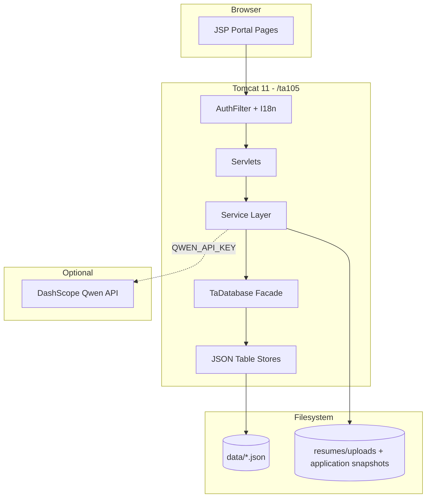

# QM HIRE · TA105

**A full-stack Teaching Assistant recruitment platform** for the BUPT × QMUL Software Engineering Group 105 course project.

QM HIRE connects **Teaching Assistants (TAs)**, **Module Organisers (MOs)**, and **Administrators** in one workflow: discover vacancies, submit applications with resume files, review candidates, manage workloads, and optionally leverage **Qwen (DashScope)** AI for ranking and drafting—always with explicit in-app consent before any model call.

| | |
|---|---|
| **Context path** | `/ta105` |
| **Artifact** | `ta105.war` |
| **Runtime** | Java 17+, Apache Tomcat 11 |
| **Persistence** | Jackson JSON files under `data/` (11 tables, no external DB) |

<p align="center">
  <a href="#quick-start">Quick Start</a> ·
  <a href="#features">Features</a> ·
  <a href="#architecture">Architecture</a> ·
  <a href="#documentation">Documentation</a> ·
  <a href="#team">Team</a>
</p>

---

## Features

### Teaching Assistant (TA)

- Browse and favourite open vacancies; filter and search job listings
- Manage multiple resumes (profile + file upload: PDF, Word, images, TXT)
- **Apply with resume file**: choose a previously uploaded resume or upload a new file; optional cover letter
- Application lifecycle: submit, withdraw, accept/decline offers
- Optional **AI assistance** (requires `QWEN_API_KEY`): resume review, vacancy match scores, per-job resume ranking when applying, cover-letter draft

### Module Organiser (MO)

- Create, edit, and publish vacancies (labels, deadlines, slots)
- Review applications: start review, send offer, reject; view applicant detail and **download submitted resume files**
- Optional **AI assistance**: applicant ranking per vacancy, offer/reject advisory (non-binding)
- In-app notifications for new applicants and responses

### Administrator

- Skills catalogue management
- **Workload** oversight with keyword and department filters
- Audit trail and system-wide data access via JSON repositories

### Platform

- Role-based auth (TA / MO / Admin), session filter, i18n (EN / 中文)
- File-backed data layer with `TaDatabase` facade; demo seed on empty `data/`
- Servlet-first Jakarta EE app (JSP + Tailwind CDN UI)

---

## Tech stack

| Layer | Technology |
|-------|------------|
| Language | Java 17 (`maven.compiler.release`) |
| Web | Jakarta Servlet 6, JSP, `@WebServlet` / `@WebFilter` |
| Server | Apache Tomcat 11 |
| JSON store | Jackson 2.x, file-per-entity under `data/` |
| AI (optional) | Alibaba DashScope (Qwen VL + text models) |
| Build & test | Maven, JUnit 6 |
| UI | JSP, Tailwind CSS (CDN), Material Symbols |

---

## Architecture

Single **WAR** deployment. The browser talks only to same-origin servlets; API keys never ship to the client.



**Design choices**

- **No ORM** — repositories over JSON files; suitable for coursework and single-JVM demos
- **Application resume snapshots** — each submission stores a file copy so MOs see what was submitted, even if the TA edits their resume later
- **AI gated by UI** — disclaimer modals + explicit “Agree and …” actions before server-side model calls

---

## Quick start

### Prerequisites

- **JDK 17+**
- **Maven 3.9+**
- **Apache Tomcat 11**

### Build & test

```bash
git clone <repository-url>
cd Software-Engineering-Group105-2026
mvn test
mvn clean package
```

### Deploy

Copy `target/ta105.war` to Tomcat `webapps/`, start Tomcat, then open:

**http://localhost:8080/ta105/**

> After redeploying a new WAR, remove the exploded folder `webapps/ta105/` if Tomcat does not pick up changes.

### Demo accounts

On first run with an **empty** `data/` directory, the seeder creates demo users. Password for all: **`password`**

| Role | Email |
|------|--------|
| TA | `test@example.com` |
| MO | `mo@example.com` |
| Admin | `admin@example.com` |

Additional demo TAs/MOs are seeded for richer scenarios—see the login page or seeder source.

### Data directory

| Setting | Default | Override |
|---------|---------|----------|
| JSON database | `./data` | JVM `-Dta105.data.dir=/absolute/path` or env `TA105_DATA_DIR` |
| Resume uploads | `{data}/resumes/uploads` | — |
| Application file snapshots | `{data}/applications/submissions` | — |

Seeding runs **only when all business tables are empty**. To reset demo data: back up and clear `data/`, then restart.

---

## Configuration

### Optional: Qwen / DashScope AI

Set before starting Tomcat (never commit keys to Git):

| Variable | Required | Description |
|----------|----------|-------------|
| `QWEN_API_KEY` | For AI features | DashScope API key (`sk-…`) |
| `QWEN_MODEL` | No | Vision model (default `qwen2.5-vl-72b-instruct`) |
| `QWEN_TEXT_MODEL` | No | Text model (default `qwen3.5-plus`) |

**Windows (Tomcat `bin/setenv.bat`):**

```bat
set "QWEN_API_KEY=sk-your-key-here"
```

**Linux / macOS:**

```bash
export QWEN_API_KEY=sk-your-key-here
```

Full AI feature matrix, consent rules, and troubleshooting: **[docs/guides/ai-and-configuration.md](docs/guides/ai-and-configuration.md)**

---

## Documentation

| Document | Description |
|----------|-------------|
| **[docs/README.md](docs/README.md)** | Documentation index |
| [docs/guides/getting-started.md](docs/guides/getting-started.md) | Extended setup & verification |
| [docs/guides/deployment.md](docs/guides/deployment.md) | Windows & macOS Tomcat deployment |
| [docs/guides/ai-and-configuration.md](docs/guides/ai-and-configuration.md) | AI capabilities, consent, env vars |
| [docs/ta-recruitment-system/](docs/ta-recruitment-system/) | Sprint 1–3 database design & ER diagrams |
| [FRONTEND_BACKEND_INTERFACE_CONTRACT.md](FRONTEND_BACKEND_INTERFACE_CONTRACT.md) | Frontend–backend contract |
| [FRONTEND_BACKEND_INTEGRATION_CHECKLIST.md](FRONTEND_BACKEND_INTEGRATION_CHECKLIST.md) | Integration checklist |

---

## Project structure

```text
Software-Engineering-Group105-2026/
├── pom.xml
├── README.md
├── data/                          # JSON persistence (runtime / demo)
├── docs/
│   ├── README.md
│   ├── guides/
│   └── ta-recruitment-system/     # Data layer design docs
└── src/
    ├── main/java/com/bupt/ta/
    │   ├── bootstrap/               # ServletContext listener, seeding
    │   ├── config/
    │   ├── domain/                  # Entities, enums, value objects
    │   ├── db/                      # JSON stores, repositories, TaDatabase
    │   ├── service/                 # Business logic
    │   ├── util/                    # Resume paths, uploads, labels, …
    │   ├── i18n/
    │   └── web/
    │       ├── filter/
    │       └── servlet/
    ├── main/webapp/
    │   ├── index.jsp                # Landing
    │   └── portal/                  # Authenticated UI
    └── test/java/                   # Unit & integration tests
```

**Key HTTP routes (under `/ta105`)**

| Path | Purpose |
|------|---------|
| `/login`, `/register` | Authentication |
| `/vacancies`, `/vacancy` | Job list & detail |
| `/application`, `/application/decision`, `/application/detail` | Apply & MO/TA actions |
| `/resumes` | Resume CRUD & upload |
| `/applications` | Application inbox |
| `/workloads` | Admin workloads |
| `/ai-match`, `/ai-resume-rank`, … | Optional AI endpoints |

---

## Development

```bash
# Run all tests
mvn test

# Package WAR
mvn clean package -DskipTests   # or with tests
```

**Conventions**

- Servlets use `DatabaseProvider.get(servletContext)` for `TaDatabase`
- Redirects with query params should use `RedirectUrls.withQueryParam` to avoid `path&param` bugs
- MO-only resources enforce ownership in `ApplicationService` / servlets

---

## Team

BUPT × QMUL Software Engineering — **Group 105**

| Name | QM ID | BUPT ID | GitHub email |
|------|-------|---------|----------------|
| Wanran Sun | 231223254 | 2023213626 | 112358wan@gmail.com |
| Xiankun Jiang | 231223542 | 2023213655 | jp2023213655@qmul.ac.uk |
| Siyuan Xue | 231223564 | 2023213657 | jp2023213657@qmul.ac.uk |
| Yutong Wu | 231223575 | 2023213658 | serovia@126.com |
| Xiaoxiao Ma | 231223715 | 2023213672 | maxiaoxiao@bupt.edu.cn |
| Rui Ma | 231223151 | 2023213616 | 940874485@qq.com |

**Teaching assistant (course):** Wang Ruijia — wang_ruijia@bupt.edu.cn

---

## License & academic use

This repository is developed for **coursework and demonstration**. Unless otherwise agreed with the university, do not use production credentials or real personal data in shared environments.

---

<p align="center">
  <sub>QM HIRE · Group 105 · BUPT / QMUL Software Engineering</sub>
</p>
