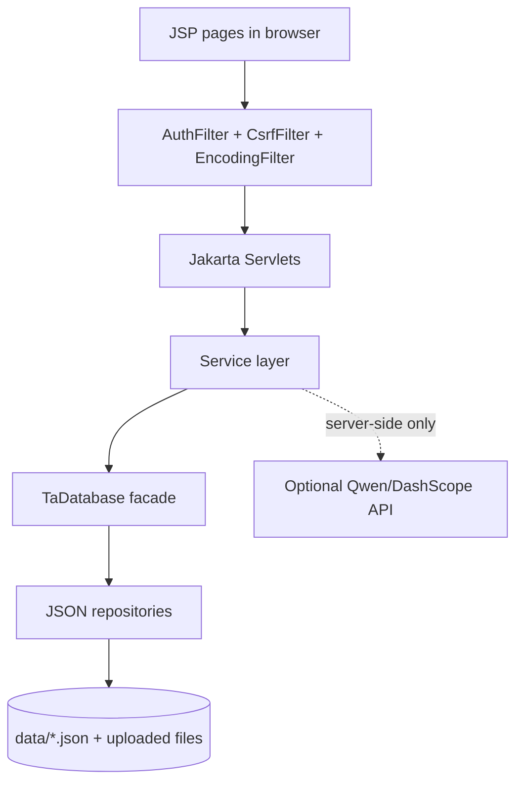

# QM HIRE · TA105

QM HIRE is a Java web application for the BUPT x QMUL Software Engineering Group 105 final coursework. It supports Teaching Assistant recruitment from vacancy discovery through application review, offer handling, workload monitoring, audit logging, and optional Qwen/DashScope AI assistance.

QM HIRE 是 BUPT x QMUL 软件工程课程 Group 105 的最终项目。系统覆盖助教招聘的完整流程：岗位浏览、简历与申请、MO 审核、录用确认、工作量监控、审计日志，以及可选的 Qwen/DashScope AI 辅助功能。

| Item | Current project state |
|---|---|
| Artifact | `target/ta105.war` |
| Context path | `/ta105` |
| Runtime | Java 17, Maven, Apache Tomcat 11 |
| Web stack | Jakarta Servlet 6, JSP, JSTL, Tailwind CDN |
| Persistence | Jackson JSON files under `data/`; no external database |
| Optional AI provider | Alibaba DashScope Qwen models, with rule-based fallback |
| Latest local verification | `mvn test` passed `133/133` tests |

---

## Coursework Submission Alignment

The handout requires the final software ZIP to include source code, test programs, code documentation such as JavaDocs, a user manual with key screenshots, and README setup/run instructions. This repository is organised to make those materials easy to inspect.

课程 handout 要求最终 `Software_groupXXX.zip` 包含源代码、测试程序、代码文档、带关键截图的用户手册，以及 README 形式的配置和运行说明。本仓库按这些交付物组织。

| Handout requirement | Project artifact |
|---|---|
| Source code | `src/main/java/`, `src/main/webapp/` |
| Test programs | `src/test/java/` |
| Code documentation | Generate with `mvn javadoc:javadoc`; output is `target/reports/apidocs/index.html` |
| User manual and screenshots | `docs/user-manual.md`, `docs/screenshots/` |
| Setup, configuration, and run instructions | This README plus `docs/guides/` |
| Final software ZIP | Submit as `Software_group105.zip` on QM+ |
| Final report | Submit separately as `Report_group105.pdf` |

Before final GitHub review, push all local `main` commits so the remote repository shows the latest software, tests, documentation, and README updates.

最终 GitHub 检查前，请确保本地 `main` 上已提交的代码全部推送到远端，方便评审看到最新版本、测试、文档和 README 更新。

---

## Features

### Teaching Assistant

- Register and sign in as a TA applicant.
- Browse, filter, and favourite published vacancies.
- Create, upload, duplicate, edit, and delete resumes when allowed.
- Bind resume skills with proficiency and years of experience.
- Apply with an existing resume or a newly uploaded resume file; submitted files are snapshotted for MO review.
- Track applications, withdraw pending applications, and accept or decline offers.
- Use optional AI assistance for resume review, vacancy matching, resume ranking, and cover-letter drafting when `QWEN_API_KEY` is configured.
- See applicant-facing skill-gap feedback only; internal match scores and hiring recommendations are reserved for MO review.

TA 端支持注册登录、岗位筛选收藏、简历上传与技能绑定、提交申请、撤回申请、接受或拒绝 offer。AI 功能是可选项；TA 只看到可行动的技能缺口反馈，不显示内部评分和录用建议。

### Module Organiser

- Create, edit, draft, publish, and cancel vacancies.
- Maintain vacancy metadata including labels, deadlines, job type, slots, start/end dates, and skill requirements.
- Review applications through the intended workflow: start review, refresh persisted match analysis, inspect applicant detail, download submitted resume files, send offers, or reject applications.
- View MO-only match analysis fields: rule score, AI/fallback score, final score, recommendation, explanation, skill coverage, missing required skills, and workload remaining hours.
- Refresh match analysis only after the application has entered review.
- Use optional AI assistance for applicant ranking and offer/reject advice; final decisions remain human-controlled.

MO 端支持岗位生命周期管理、技能要求配置、申请审核、简历下载、发送 offer 和拒绝申请。完整评分和推荐只对 MO 可见，且匹配分析必须在开始审核后刷新。

### Administrator

- Manage TA, MO, and Admin users.
- Create accounts, edit profiles, reset passwords, and deactivate/reactivate non-admin users.
- Manage the skills catalogue with reference protection for skills already used by resumes or job requirements.
- Monitor accepted TA workloads, weekly hours, capacity, estimated income, and workload status.
- View rule-based workload rebalance suggestions that highlight high-utilisation TAs and possible lower-load alternatives.
- Search audit logs and export audit data as CSV.

管理员端支持用户管理、技能目录维护、工作量监控、规则派生的工作量再平衡建议，以及审计日志查询和 CSV 导出。

### Platform, Security, And Reliability

- Role-based access control for TA, MO, and Admin workflows.
- Session hardening on login with session id rotation.
- Global CSRF protection for unsafe requests.
- File upload validation for allowed extensions, MIME type, file signature, and upload size.
- Public password reset no longer changes passwords directly; administrators reset passwords from Admin Users.
- AI requests require explicit user consent and create `AI_REQUEST` audit entries without storing prompts or full model outputs.
- Core recruitment flows continue without Qwen because persisted match analysis has a rule-based fallback.
- Runtime data is stored in JSON files through repository interfaces and the `TaDatabase` facade.

平台层实现了角色访问控制、登录 session 加固、CSRF 防护、上传文件校验、AI 同意与审计，以及 Qwen 不可用时的规则兜底。

---

## Architecture Overview

QM HIRE is a single WAR application deployed to Tomcat. Browser requests go through filters and servlets, business rules live in services, and persistence is accessed through `TaDatabase` and JSON repositories. API keys are read server-side only and are never sent to the browser.

QM HIRE 是单 WAR 部署应用。浏览器请求进入 Filter 和 Servlet，业务逻辑位于 Service 层，数据通过 `TaDatabase` 和 JSON Repository 读写。AI API key 只在服务端读取，不暴露给前端。



Key design choices:

- JSON persistence satisfies the coursework no-external-database constraint and is suitable for single-JVM demonstration.
- Application submissions keep resume file snapshots so MO review is based on the file submitted at application time.
- AI is optional and guarded by consent, server-side validation, audit logging, and rule-based fallback.
- Tests cover services, repositories, utilities, filters, security helpers, and key servlets.

---

## Quick Start

### Prerequisites

- JDK 17 or later
- Maven 3.9 or later
- Apache Tomcat 11

### Build, Test, And Generate Documentation

```bash
git clone <repository-url>
cd <project-folder>

mvn test
mvn clean package
mvn javadoc:javadoc
```

Expected outputs:

- Tests: current local verification is `133/133` passing.
- WAR: `target/ta105.war`.
- JavaDocs: `target/reports/apidocs/index.html`.

构建和验证推荐依次运行 `mvn test`、`mvn clean package`、`mvn javadoc:javadoc`。WAR 输出到 `target/ta105.war`，JavaDocs 输出到 `target/reports/apidocs/index.html`。

### Deploy To Tomcat

1. Copy `target/ta105.war` to the Tomcat `webapps/` directory.
2. Start or restart Tomcat 11.
3. Open `http://localhost:8080/ta105/`.
4. If Tomcat does not pick up a redeployed WAR, stop Tomcat and remove the exploded `webapps/ta105/` directory before restarting.

部署时将 `target/ta105.war` 复制到 Tomcat 的 `webapps/` 目录，启动后访问 `http://localhost:8080/ta105/`。

### Run The Website Locally

Use this checklist when starting the website for local testing, screenshots, or the final video.

本地测试、截图和录制最终视频时，可以按下面步骤启动网站。

**Option A: command-line Tomcat**

```bash
# 1. Build the WAR from the project root.
mvn clean package

# 2. Copy the WAR to Tomcat. Replace CATALINA_HOME with your Tomcat directory.
cp target/ta105.war "$CATALINA_HOME/webapps/ta105.war"

# 3. Optional: use a dedicated local data directory for the demo.
export TA105_DATA_DIR="$PWD/data"

# 4. Start Tomcat.
"$CATALINA_HOME/bin/startup.sh"

# 5. Open the website.
open http://localhost:8080/ta105/
```

For Windows, use the same build command, copy `target\ta105.war` into `%CATALINA_HOME%\webapps\ta105.war`, then run `%CATALINA_HOME%\bin\startup.bat` and open `http://localhost:8080/ta105/`.

Windows 环境下同样先运行 `mvn clean package`，然后把 `target\ta105.war` 复制到 `%CATALINA_HOME%\webapps\ta105.war`，运行 `%CATALINA_HOME%\bin\startup.bat`，最后打开 `http://localhost:8080/ta105/`。

**Option B: IntelliJ IDEA with local Tomcat**

1. Open this repository in IntelliJ IDEA.
2. Confirm the Project SDK is Java 17.
3. Create a Tomcat Server run configuration.
4. Add the `ta105:war exploded` or `ta105.war` artifact.
5. Set the application context to `/ta105`.
6. Optionally add `TA105_DATA_DIR=<absolute-path-to-project>/data` as an environment variable.
7. Start the configuration and open `http://localhost:8080/ta105/`.

IntelliJ IDEA 启动方式适合日常调试：配置本地 Tomcat，部署 `ta105` WAR 或 exploded artifact，并确认 context path 为 `/ta105`。

**Local run checks**

- Login page opens at `/ta105/login`.
- Demo accounts work after seeding: `test@example.com`, `mo@example.com`, `admin@example.com`; password is `password`.
- Uploaded resume files are written under `data/resumes/uploads/`.
- Application snapshot files are written under `data/applications/submissions/`.
- If a new WAR is not reflected, stop Tomcat and delete the exploded `webapps/ta105/` folder before restarting.

本地运行成功后，应能打开登录页，使用演示账号登录，并在提交简历或申请后看到 JSON 数据和上传文件写入 `data/` 目录。

### Demo Accounts

When the configured `data/` directory is empty, the seeder creates demo accounts. The demo password is `password`.

| Role | Email |
|---|---|
| TA | `test@example.com` |
| MO | `mo@example.com` |
| Admin | `admin@example.com` |

初次使用空数据目录时，系统会自动创建演示账号。三个主要演示账号密码均为 `password`。

### Data Directory

By default, runtime data is stored under `./data`. To use another directory:

```bash
export TA105_DATA_DIR=/absolute/path/to/data
```

or pass the JVM property:

```bash
-Dta105.data.dir=/absolute/path/to/data
```

Stored runtime files include:

- JSON database files under `data/*.json`.
- Resume uploads under `data/resumes/uploads/`.
- Application submission snapshots under `data/applications/submissions/`.

Seeder data is created only when all business tables are empty. To reset a demo, stop Tomcat, back up `data/`, clear the business JSON files, and restart.

默认数据目录为 `./data`。如需重置演示数据，应先停止 Tomcat，备份数据目录，然后清空业务 JSON 文件并重启。

---

## Optional AI Configuration

AI features use Qwen/DashScope and are optional. Without `QWEN_API_KEY`, direct Qwen buttons are disabled and persisted match analysis still works through rule-based fallback.

AI 功能使用 Qwen/DashScope，属于可选能力。没有 `QWEN_API_KEY` 时，核心招聘流程仍可使用，持久化匹配分析会走规则兜底。

| Variable | Required | Description |
|---|---|---|
| `QWEN_API_KEY` | Required for direct AI calls | DashScope API key |
| `QWEN_MODEL` | No | Vision/multimodal resume model |
| `QWEN_TEXT_MODEL` | No | Text model for ranking, matching, and drafting |

Windows Tomcat `bin/setenv.bat`:

```bat
set "QWEN_API_KEY=sk-your-key-here"
```

Linux or macOS:

```bash
export QWEN_API_KEY=sk-your-key-here
```

For consent rules, fallback behaviour, and troubleshooting, see `docs/guides/ai-and-configuration.md`.

---

## Documentation

| Document | Purpose |
|---|---|
| `docs/README.md` | Documentation index |
| `docs/user-manual.md` | User workflows and screenshot checklist |
| `docs/guides/deployment.md` | Tomcat deployment and data-directory notes |
| `docs/guides/ai-and-configuration.md` | Qwen configuration, consent, and fallback behaviour |
| `docs/non-functional-requirements.md` | Quality attributes and verification methods |
| `docs/risk-register.md` | Project risks and mitigations |
| `docs/final-acceptance-checklist.md` | Manual acceptance script for the final demo |
| `docs/ta-recruitment-system/` | Database, repository, ER, and sprint architecture documents |

文档目录包含用户手册、部署说明、AI 配置、非功能需求、风险登记表和最终验收清单。最终交付前应补齐 `docs/screenshots/` 中的关键页面截图。

---

## Important Routes

All paths are under the `/ta105` context.

| Area | Routes |
|---|---|
| Authentication | `/login`, `/logout`, `/register`, `/forgot-password` |
| TA portal | `/dashboard`, `/resumes`, `/vacancies`, `/vacancy`, `/applications`, `/messages`, `/settings`, `/favorites` |
| Application workflow | `/application`, `/application/detail`, `/application/decision`, `/match-analysis` |
| MO vacancy management | `/vacancy/create`, `/vacancy/edit` |
| Admin | `/admin/users`, `/admin/skills`, `/admin/audit`, `/admin/database`, `/workloads` |
| Optional AI | `/ai-match`, `/ai-resume-rank`, `/ai-mo-applicants-rank`, `/ai-mo-application-advice`, `/ai-ta-cover-letter` |

以上路由均部署在 `/ta105` 上下文路径下，例如登录页为 `http://localhost:8080/ta105/login`。

---

## Project Structure

```text
.
├── README.md
├── pom.xml
├── Software_group105.zip              # final QM+ software package when prepared locally
├── docs/
│   ├── README.md
│   ├── user-manual.md
│   ├── screenshots/
│   ├── guides/
│   └── ta-recruitment-system/
├── src/
│   ├── main/java/com/bupt/ta/
│   │   ├── bootstrap/
│   │   ├── config/
│   │   ├── db/
│   │   ├── domain/
│   │   ├── dto/
│   │   ├── i18n/
│   │   ├── service/
│   │   ├── util/
│   │   └── web/
│   ├── main/webapp/
│   └── test/java/com/bupt/ta/
└── target/
    ├── ta105.war
    └── reports/apidocs/
```

`target/` and local ZIP artifacts are build/submission outputs. If they are absent after cloning, regenerate them with the commands in Quick Start.

`target/` 和本地 ZIP 属于构建或提交产物。若克隆仓库后不存在，可按 Quick Start 中的命令重新生成。

---

## Development And Verification

Recommended final verification:

```bash
mvn test
mvn clean package
mvn javadoc:javadoc
```

Current local result:

- `mvn test`: `133` tests, `0` failures, `0` errors.
- `mvn clean package`: creates `target/ta105.war`.
- `mvn javadoc:javadoc`: creates `target/reports/apidocs/index.html`.

Development conventions:

- Use `DatabaseProvider.get(servletContext)` to obtain `TaDatabase` in servlets.
- Keep business rules in services rather than JSP pages.
- Use `RedirectUrls.withQueryParam` for redirects with messages.
- Enforce role and ownership checks on the server side.
- Protect unsafe requests with CSRF tokens.
- Require explicit AI consent before sending personal data to Qwen.
- Do not commit real credentials, real personal data, or production API keys.

最终提交前建议重新运行测试、打包和 JavaDocs 生成命令，并确认 GitHub 远端包含最新提交。

---

## Team

BUPT x QMUL Software Engineering - Group 105

| Name | QM ID | BUPT ID | GitHub email |
|---|---|---|---|
| Wanran Sun | 231223254 | 2023213626 | 112358wan@gmail.com |
| Xiankun Jiang | 231223542 | 2023213655 | jp2023213655@qmul.ac.uk |
| Siyuan Xue | 231223564 | 2023213657 | jp2023213657@qmul.ac.uk |
| Yutong Wu | 231223575 | 2023213658 | serovia@126.com |
| Xiaoxiao Ma | 231223715 | 2023213672 | maxiaoxiao@bupt.edu.cn |
| Rui Ma | 231223151 | 2023213616 | 940874485@qq.com |

Teaching assistant for the course: Wang Ruijia, `wang_ruijia@bupt.edu.cn`.

---

## Academic Use

This repository is developed for coursework and demonstration. Do not use production credentials or real personal data in shared environments.

本仓库仅用于课程项目和演示环境。请勿在共享环境中使用生产凭据或真实个人数据。
