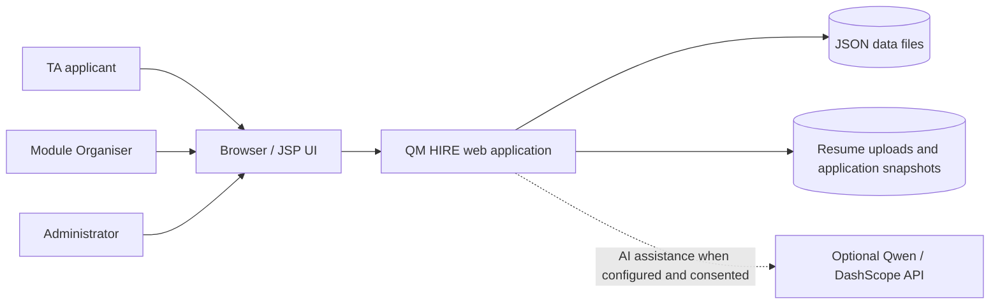
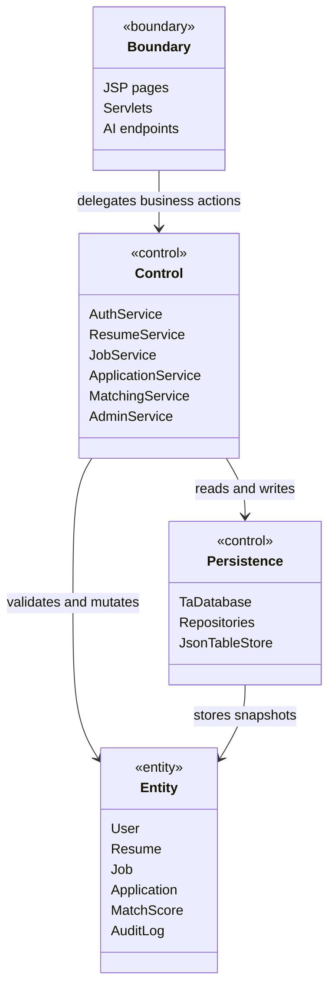
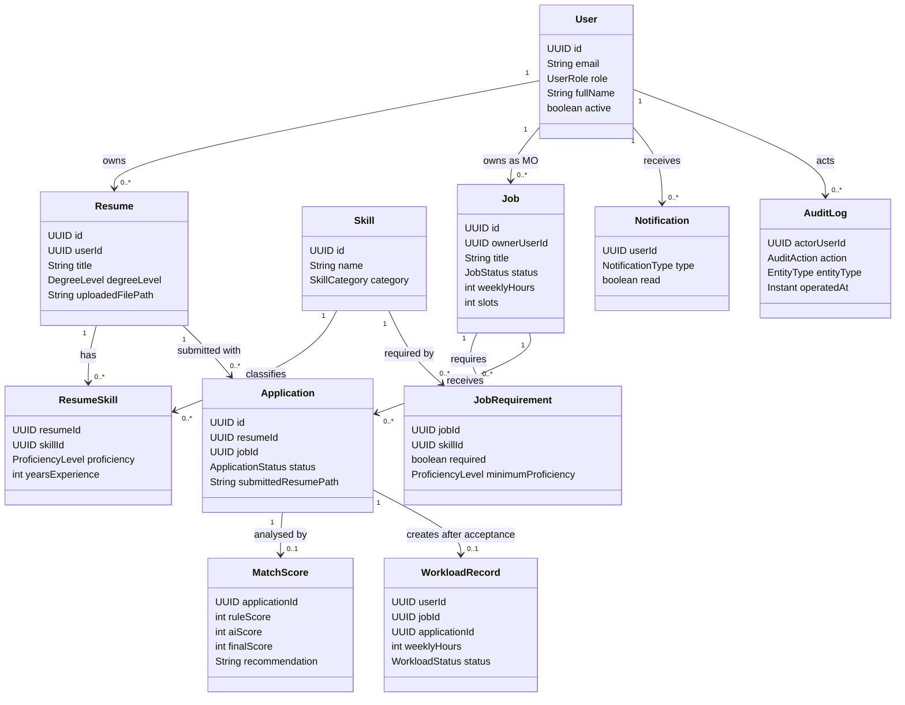
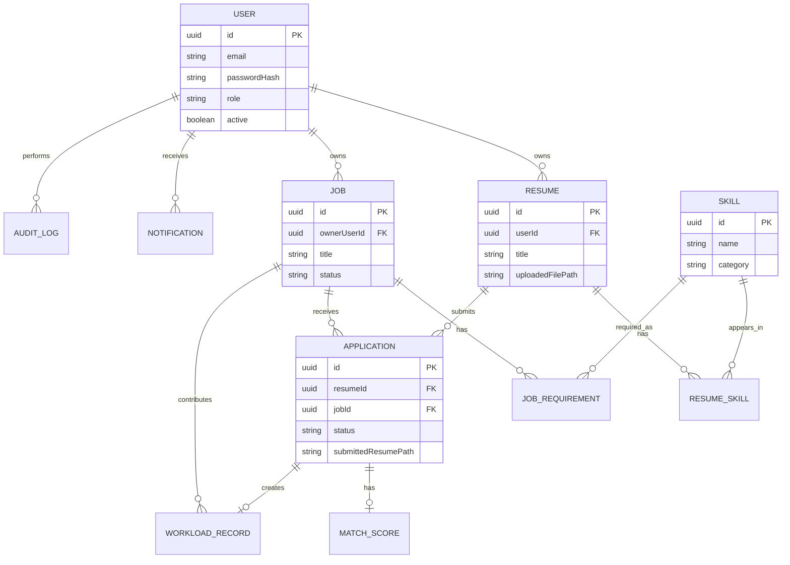
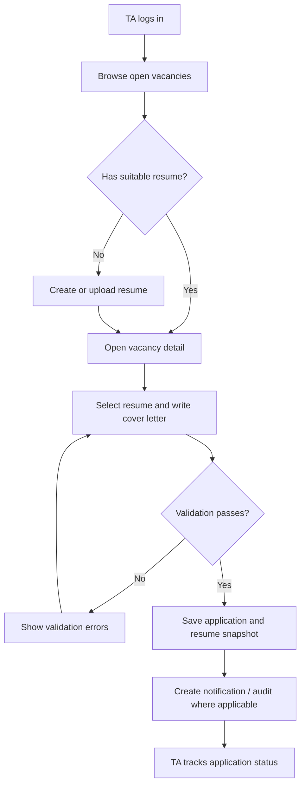
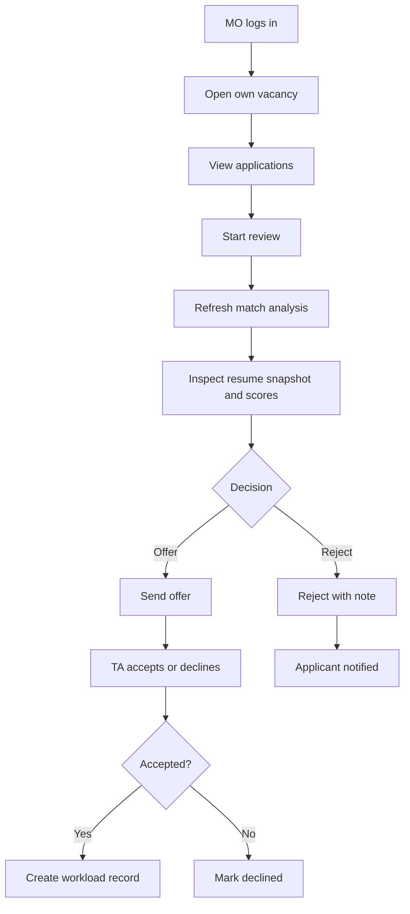
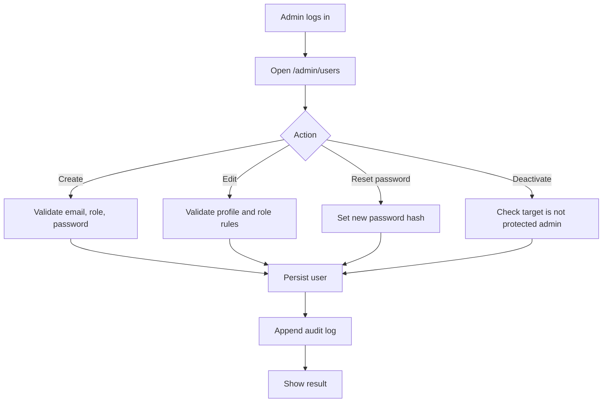

# 02 分析模型

## 课程依据

分析阶段的目标不是描述代码怎么写，而是建立问题域模型：系统边界是什么、用户通过哪些用例达成目标、关键领域对象如何关联、业务流程如何流动。EBU6304 的 Analysis slides 使用 EBC 方法将对象分为 Boundary、Control、Entity，并要求通过 UML/diagram 把需求转化为可讨论的模型。

| Slide | 本文档产物 |
|---|---|
| EBU6304_03 Requirements | 用例来自已识别的功能需求和非功能需求 |
| EBU6304_04 User stories and prototyping | 用户故事被映射为用例和活动流 |
| EBU6304_05 Analysis | EBC、领域模型、activity diagram、class/ER 分析模型 |
| EBU6304_17 Revision | 分析模型与设计、实现、测试保持追踪 |

## System Context

## Use Case Diagram

```mermaid
flowchart TB
  TA["TA applicant"]
  MO["Module Organiser"]
  Admin["Administrator"]

  subgraph TAUseCases["TA use cases"]
    UC1["Register / login"]
    UC2["Maintain profile and resumes"]
    UC3["Browse and favourite vacancies"]
    UC4["Submit application"]
    UC5["Track status and respond to offer"]
    UC6["Request optional AI help"]
  end

  subgraph MOUseCases["MO use cases"]
    UC7["Create and publish vacancy"]
    UC8["Maintain skill requirements"]
    UC9["Review applications"]
    UC10["Refresh match analysis"]
    UC11["Send offer or rejection"]
  end

  subgraph AdminUseCases["Admin use cases"]
    UC12["Manage users"]
    UC13["Manage skills"]
    UC14["View audit logs"]
    UC15["Monitor workloads"]
    UC16["Inspect JSON database demo"]
  end

  TA --> UC1
  TA --> UC2
  TA --> UC3
  TA --> UC4
  TA --> UC5
  TA --> UC6
  MO --> UC1
  MO --> UC7
  MO --> UC8
  MO --> UC9
  MO --> UC10
  MO --> UC11
  Admin --> UC1
  Admin --> UC12
  Admin --> UC13
  Admin --> UC14
  Admin --> UC15
  Admin --> UC16
```

## EBC Analysis

### Boundary Objects

Boundary 对象负责和用户或外部系统交互。当前系统中的主要 Boundary 是 Servlet、JSP 和可选 AI provider 入口。

| Boundary | Responsibility | Evidence |
|---|---|---|
| JSP pages | 展示 portal 页面、表单、状态、列表和错误消息 | `src/main/webapp/portal/*.jsp`、`db-demo.jsp` |
| Auth / portal servlets | 接收 HTTP 请求，做轻量请求解析和转发 | `LoginServlet`、`RegisterServlet`、`DashboardServlet` |
| TA workflow servlets | 处理简历、岗位、申请、消息等 TA 操作入口 | `ResumesServlet`、`VacanciesServlet`、`ApplicationSubmitServlet` |
| MO workflow servlets | 处理岗位维护、申请详情和匹配分析 | `VacancyCreateServlet`、`VacancyEditServlet`、`ApplicationDetailServlet` |
| Admin servlets | 处理用户、技能、审计、数据库演示和工作量 | `AdminUsersServlet`、`AdminSkillsServlet`、`AdminAuditServlet`、`DbDemoServlet` |
| AI servlets | 接收用户同意后的 AI 请求 | `AiMatchServlet`、`AiResumeRankServlet`、`AiTaCoverLetterServlet`、MO AI servlets |

### Control Objects

Control 对象承载业务规则、状态转换、匹配计算和跨实体协调。

| Control | Responsibility | Evidence |
|---|---|---|
| `AuthService` | 登录认证、密码验证、用户状态检查 | `src/main/java/com/bupt/ta/service/AuthService.java` |
| `TaAccountService` | TA 自助注册规则 | `TaAccountService.java` |
| `ResumeService` | 简历版本、技能、上传文件关联 | `ResumeService.java` |
| `JobService` | 岗位生命周期、MO 所有权和技能要求 | `JobService.java` |
| `ApplicationService` | 申请提交、撤回、审核、offer、accept/decline | `ApplicationService.java` |
| `MatchingService` | 规则匹配、AI/兜底分、缺失技能和推荐解释 | `MatchingService.java` |
| `AdminService` | 用户管理、审计查询、工作量聚合和再平衡建议 | `AdminService.java` |
| `DbDemoService` | 课程数据库演示页对各 Repository 的安全封装 | `DbDemoService.java` |
| `QwenAiService` | Qwen/DashScope 请求构造和响应解析 | `QwenAiService.java` |

### Entity Objects

Entity 对象代表持久化领域数据，主要位于 `com.bupt.ta.domain.entity`。

| Entity | Meaning |
|---|---|
| `User` | TA、MO、Admin 用户 |
| `Resume` | TA 简历版本和上传文件引用 |
| `Skill` | 技能目录项 |
| `ResumeSkill` | 简历和技能之间的熟练度关系 |
| `Job` | TA 岗位 |
| `JobRequirement` | 岗位所需技能 |
| `Application` | 岗位申请及状态 |
| `MatchScore` | 申请或简历与岗位的匹配分析 |
| `WorkloadRecord` | accepted 申请产生的工作量 |
| `Notification` | 用户通知 |
| `AuditLog` | 审计日志 |

## EBC Diagram

## Domain Model

## ER / Data Model

JSON 文件不是关系数据库，但数据仍按表式结构组织。ER 图描述逻辑关系，实际文件由 `FileTaDatabase` 映射到 `data/*.json`。

## Core Activity Diagrams

### TA Application Flow

### MO Review Flow

### Admin User Management Flow

## Analysis Risks

| Risk | Analysis observation | Mitigation in design/docs |
|---|---|---|
| User roles overlap in UI | TA, MO and Admin share login but have different permissions | Explicit RBAC, route table, role-specific use cases |
| Application state transitions can become inconsistent | Offer/accept/withdraw/reject paths affect Application, Notification, WorkloadRecord | State diagram and `ApplicationService` tests |
| JSON persistence may be mistaken for relational DB | Logical ER exists, but implementation is file-backed | Architecture doc states single-JVM constraint and atomic writes |
| AI might be treated as decision maker | AI produces recommendations and text only | Ethics doc requires consent, audit and human final decision |
