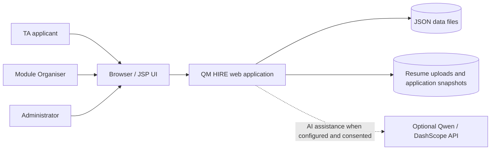
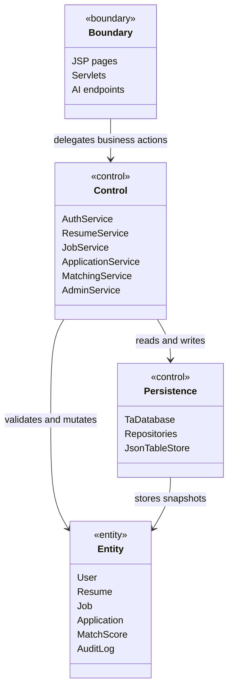
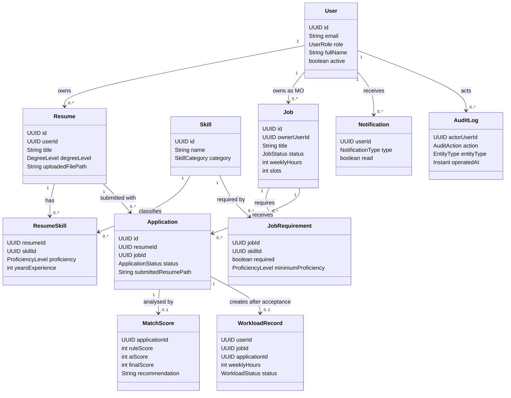
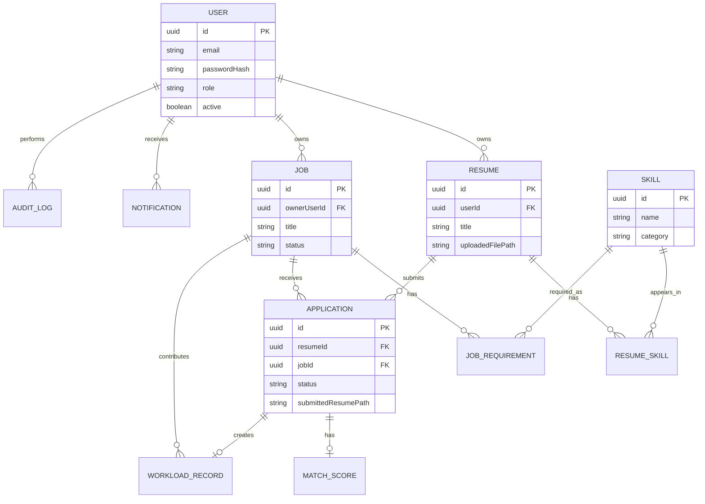
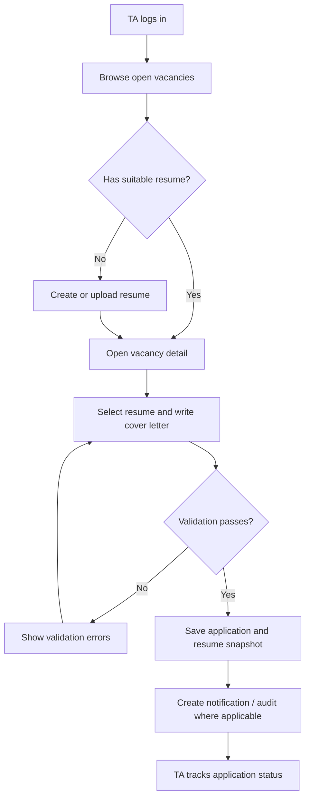
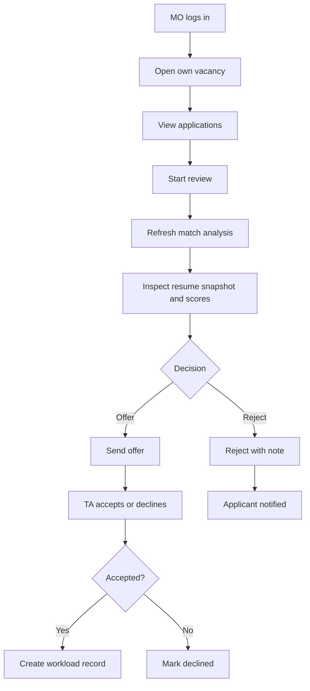
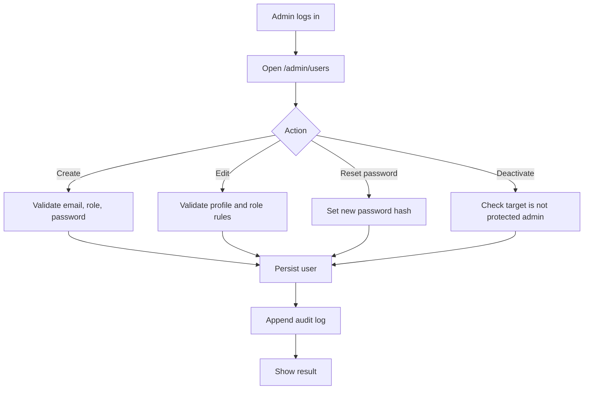

# 02 Analysis Model

## Course Basis
The goal of the analysis phase is not to describe how code is written, but to build a problem domain model: what the system boundary is, which use cases users use to achieve their goals, how key domain objects are related, and how business processes flow. The EBU6304 Analysis slides use the EBC method to classify objects into Boundary, Control, and Entity, and require converting requirements into discussable models via UML/diagrams.

| Slide | Document Deliverable |
|---|---|
| EBU6304_03 Requirements | Use cases derived from identified functional and non-functional requirements |
| EBU6304_04 User stories and prototyping | User stories mapped to use cases and activity flows |
| EBU6304_05 Analysis | EBC, domain model, activity diagram, class/ER analysis model |
| EBU6304_17 Revision | Traceability maintained between analysis model, design, implementation, and testing |

## System Context



## Use Case Diagram

```mermaid
flowchart TB
  TA["TA applicant"]
  MO["Module Organiser"]
  Admin["Administrator"]

  subgraph TAUseCases["TA use cases"]
    UC1["Register / login"]
    UC2["Maintain profile and resumes"]
    UC3["Browse and favourite vacancies"]
    UC4["Submit application"]
    UC5["Track status and respond to offer"]
    UC6["Request optional AI help"]
  end

  subgraph MOUseCases["MO use cases"]
    UC7["Create and publish vacancy"]
    UC8["Maintain skill requirements"]
    UC9["Review applications"]
    UC10["Refresh match analysis"]
    UC11["Send offer or rejection"]
  end

  subgraph AdminUseCases["Admin use cases"]
    UC12["Manage users"]
    UC13["Manage skills"]
    UC14["View audit logs"]
    UC15["Monitor workloads"]
    UC16["Inspect JSON database demo"]
  end

  TA --> UC1
  TA --> UC2
  TA --> UC3
  TA --> UC4
  TA --> UC5
  TA --> UC6
  MO --> UC1
  MO --> UC7
  MO --> UC8
  MO --> UC9
  MO --> UC10
  MO --> UC11
  Admin --> UC1
  Admin --> UC12
  Admin --> UC13
  Admin --> UC14
  Admin --> UC15
  Admin --> UC16
```



## EBC Analysis

### Boundary Objects
Boundary objects handle interaction with users or external systems. The main boundaries in the current system are Servlets, JSPs, and the optional AI provider entry points.

| Boundary | Responsibility | Evidence |
|---|---|---|
| JSP pages | Render portal pages, forms, statuses, lists, and error messages | `src/main/webapp/portal/*.jsp`, `db-demo.jsp` |
| Auth / portal servlets | Receive HTTP requests, perform lightweight parsing and forwarding | `LoginServlet`, `RegisterServlet`, `DashboardServlet` |
| TA workflow servlets | Entry points for resume, vacancy, application, and messaging operations for TA | `ResumesServlet`, `VacanciesServlet`, `ApplicationSubmitServlet` |
| MO workflow servlets | Handle vacancy maintenance, application details, and matching analysis | `VacancyCreateServlet`, `VacancyEditServlet`, `ApplicationDetailServlet` |
| Admin servlets | Handle users, skills, auditing, database demo, and workloads | `AdminUsersServlet`, `AdminSkillsServlet`, `AdminAuditServlet`, `DbDemoServlet` |
| AI servlets | Receive AI requests after user consent | `AiMatchServlet`, `AiResumeRankServlet`, `AiTaCoverLetterServlet`, MO AI servlets |

### Control Objects
Control objects implement business rules, state transitions, matching calculations, and cross-entity coordination.

| Control | Responsibility | Evidence |
|---|---|---|
| `AuthService` | Authentication, password validation, user status checks | `src/main/java/com/bupt/ta/service/AuthService.java` |
| `TaAccountService` | TA self-registration rules | `TaAccountService.java` |
| `ResumeService` | Resume versioning, skills, and uploaded file association | `ResumeService.java` |
| `JobService` | Job lifecycle, MO ownership, and skill requirements | `JobService.java` |
| `ApplicationService` | Application submission, withdrawal, review, offer, accept/decline | `ApplicationService.java` |
| `MatchingService` | Rule-based matching, AI/fallback scoring, missing skills, and recommendation explanations | `MatchingService.java` |
| `AdminService` | User management, audit queries, workload aggregation, and rebalancing suggestions | `AdminService.java` |
| `DbDemoService` | Secure wrapper for repositories in the course database demo page | `DbDemoService.java` |
| `QwenAiService` | Qwen/DashScope request construction and response parsing | `QwenAiService.java` |

### Entity Objects
Entity objects represent persisted domain data, primarily located in `com.bupt.ta.domain.entity`.

| Entity | Meaning |
|---|---|
| `User` | TA, MO, Admin users |
| `Resume` | TA resume versions and uploaded file references |
| `Skill` | Skill catalog entry |
| `ResumeSkill` | Proficiency relationship between resume and skill |
| `Job` | TA vacancy |
| `JobRequirement` | Required skills for a job |
| `Application` | Job application and its status |
| `MatchScore` | Matching analysis between application/resume and job |
| `WorkloadRecord` | Workload generated by accepted applications |
| `Notification` | User notifications |
| `AuditLog` | Audit log entries |

## EBC Diagram



## Domain Model



## ER / Data Model
JSON files are not relational databases, but data is still organized in a tabular structure. The ER diagram describes logical relationships; the actual files are mapped to `data/*.json` by `FileTaDatabase`.



## Core Activity Diagrams

### TA Application Flow



### MO Review Flow



### Admin User Management Flow



## Analysis Risks

| Risk | Analysis observation | Mitigation in design/docs |
|---|---|---|
| User roles overlap in UI | TA, MO and Admin share login but have different permissions | Explicit RBAC, route table, role-specific use cases |
| Application state transitions can become inconsistent | Offer/accept/withdraw/reject paths affect Application, Notification, WorkloadRecord | State diagram and `ApplicationService` tests |
| JSON persistence may be mistaken for relational DB | Logical ER exists, but implementation is file-backed | Architecture doc states single-JVM constraint and atomic writes |
| AI might be treated as decision maker | AI produces recommendations and text only | Ethics doc requires consent, audit and human final decision |
```