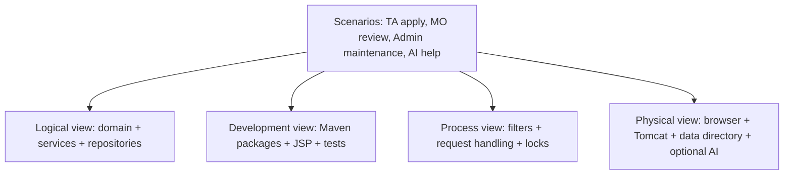
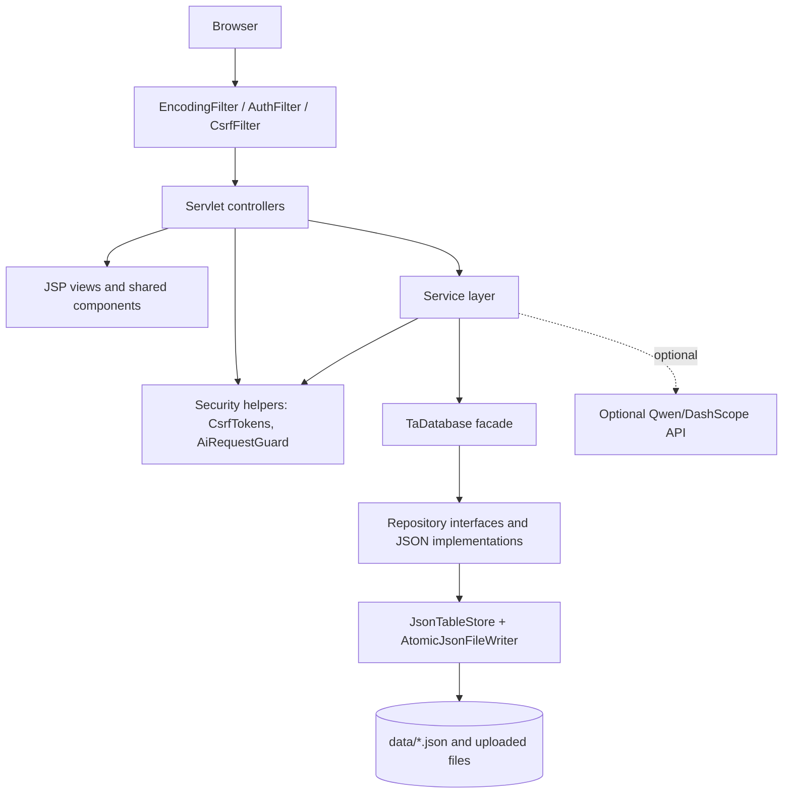
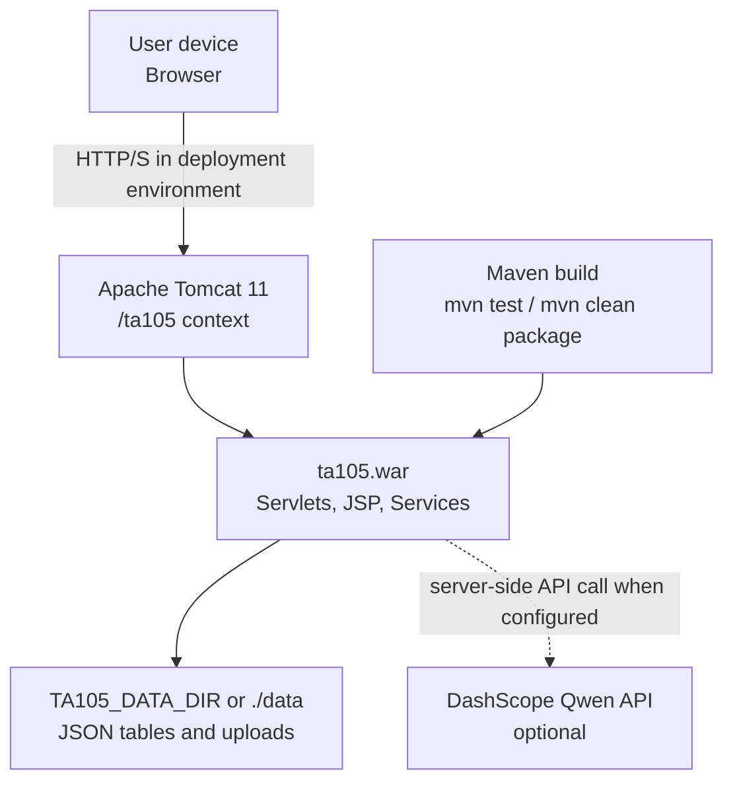
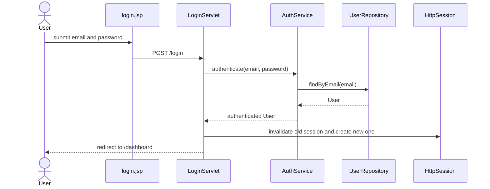
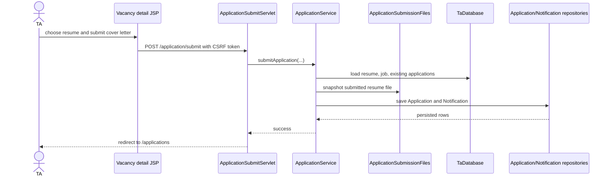
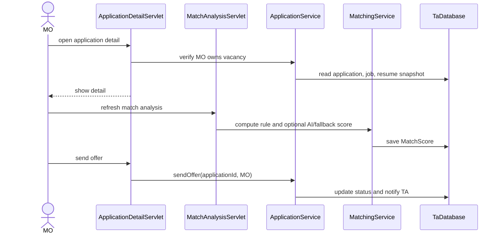
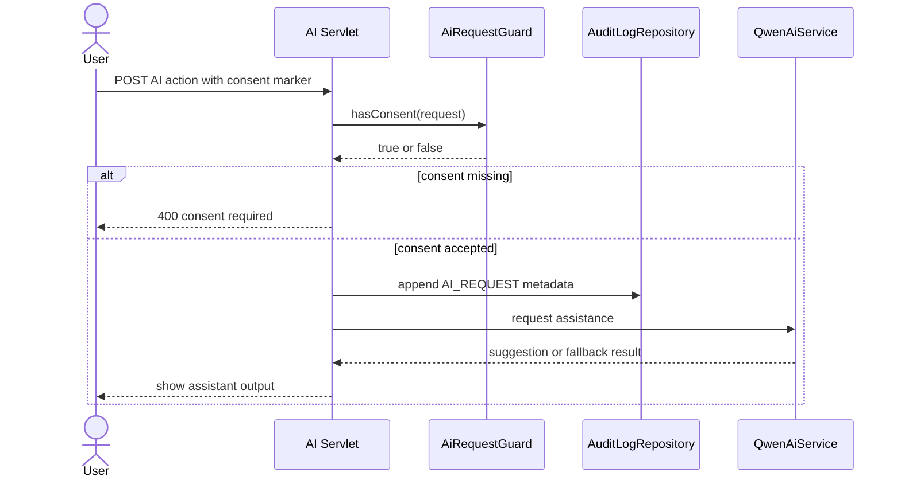
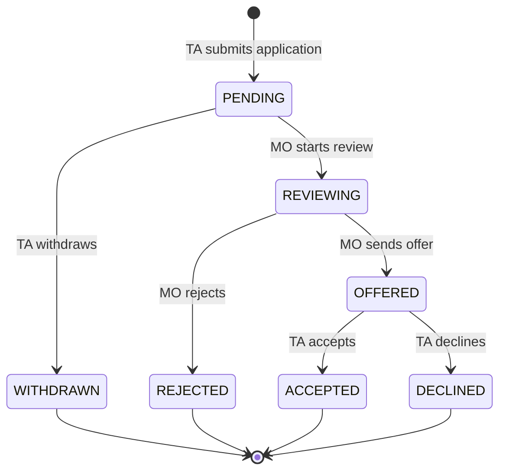

# 03 架构与设计

## 课程依据

设计阶段把分析模型转化为可实现、可测试、可维护的结构。EBU6304 的 Design、Architecture、Design Principles 和 Design Patterns slides 要求我们说明架构视图、模块职责、接口边界、对象交互、状态转换，以及 SOLID 和设计模式是否被恰当使用。

| Slide | 本文档产物 |
|---|---|
| EBU6304_06 Design | UML sequence、state、package/component 设计 |
| EBU6304_09 Software Architecture | 4+1 view、部署视图、架构质量属性 |
| EBU6304_14 Design Principles | SOLID、内聚、耦合、职责划分 |
| EBU6304_15 Design Patterns | Facade、Repository、Filter、Strategy-like fallback 等模式说明 |
| EBU6304_17 Revision | 设计与实现、测试、质量风险的综合复习 |

## Architecture Decision Summary

| Decision | Chosen approach | Rationale | Trade-off |
|---|---|---|---|
| Deployment unit | Single Java WAR on Tomcat 11 | 符合课程 Java Web 项目和易演示要求 | 不适合多节点生产部署 |
| Presentation | JSP + Servlet + JSTL + shared components | 与 Jakarta Servlet 课程栈贴合，部署简单 | 前端交互能力弱于 SPA |
| Business layer | Service classes per workflow | 把业务规则从 Servlet 中分离，提高测试性 | 需要维护 service 边界 |
| Persistence | JSON file store behind `TaDatabase` facade and repositories | 无外部数据库依赖，便于课程演示和测试隔离 | 并发和查询能力弱于 RDBMS |
| AI | Optional Qwen/DashScope service with rule fallback | 核心流程不依赖外部 AI；伦理上保持人类决策 | AI 可用性和输出质量不完全可控 |
| Security | Filter + servlet/service role checks + upload validation + audit | 覆盖常见 Web 风险 | 仍需生产级 headers、rate limit、external auth 才能上线 |

## 4+1 Architecture View

| View | Content in QM HIRE | Main evidence |
|---|---|---|
| Logical view | Domain entities、services、repositories、workflow rules | `domain/`、`service/`、`db/repository/` |
| Development view | Maven project, layered Java packages, JSP structure, tests | `pom.xml`、`src/main/java`、`src/main/webapp`、`src/test/java` |
| Process view | Request lifecycle through filters, servlets, services and persistence locks | `AuthFilter`、`CsrfFilter`、`JsonTableStore` |
| Physical view | Browser, Tomcat WAR, local JSON data directory, optional DashScope API | `README.md`、`AppConfig`、`QwenAiService` |
| Scenarios | TA application, MO review, Admin maintenance, AI assistance | sequence diagrams below |

## Component Diagram

## Package / Layer Diagram

```mermaid
flowchart LR
  subgraph Web["web layer"]
    ServletPkg["com.bupt.ta.web.servlet"]
    FilterPkg["com.bupt.ta.web.filter"]
    JspPkg["src/main/webapp"]
  end

  subgraph Service["service layer"]
    ServicePkg["com.bupt.ta.service"]
    UtilPkg["com.bupt.ta.util"]
    SecurityPkg["com.bupt.ta.web.security"]
  end

  subgraph Domain["domain layer"]
    EntityPkg["domain.entity"]
    EnumPkg["domain.enums"]
    ValuePkg["domain.value"]
    DtoPkg["dto"]
  end

  subgraph Persistence["persistence layer"]
    FacadePkg["db.facade"]
    RepoPkg["db.repository"]
    StorePkg["db.store"]
    CorePkg["db.core"]
  end

  Web --> Service
  Service --> Domain
  Service --> Persistence
  Persistence --> Domain
```

## Deployment Diagram

## Key Sequence Diagrams

### Login And Session Hardening

### TA Application Submission

### MO Review And Offer

### AI Request Consent And Audit

## Application State Diagram

## SOLID Review

| Principle | Current design evidence | Assessment |
|---|---|---|
| Single Responsibility | Servlet handles HTTP flow; Service handles business rules; Repository handles persistence | Mostly satisfied. Some large servlets such as `DbDemoServlet` are acceptable because they are admin demo orchestration, but should not absorb core business rules |
| Open/Closed | Repository interfaces and `TaDatabase` allow persistence implementation replacement | Satisfied for persistence boundary; less formal extension points for matching strategy |
| Liskov Substitution | JSON repositories implement repository contracts without changing caller expectations | Satisfied within current scope |
| Interface Segregation | Repository interfaces are domain-specific instead of one giant DAO | Satisfied |
| Dependency Inversion | Services depend mainly on `TaDatabase` facade and repository contracts, not raw files | Mostly satisfied; Servlet construction still obtains concrete database through `DatabaseProvider` because it is a lightweight Servlet app |

## Design Patterns

| Pattern | Where used | Why appropriate | Caution |
|---|---|---|---|
| Facade | `TaDatabase` exposes typed repositories through a single access point | Simplifies service dependencies and hides file store setup | Do not put business rules into the facade |
| Repository | `UserRepository`, `JobRepository`, `ApplicationRepository` and JSON implementations | Isolates persistence and supports tests with temporary data | Keep query methods intention-revealing |
| Template / generic base | `BaseJsonRepository` and `JsonTableStore` share CRUD mechanics | Reduces duplication across JSON tables | Domain validation must stay in concrete repository/service |
| Filter | `AuthFilter`, `CsrfFilter`, `EncodingFilter` | Centralises cross-cutting request concerns | Role/ownership checks still belong in workflow-specific code |
| Strategy-like fallback | `MatchingService` combines rule score with optional AI/fallback | Core workflow remains usable without external AI | A formal strategy interface could be added if algorithms multiply |
| Data Transfer Object | `ApplicationDTO`, `ConversationDTO`, `MessageDTO`, `MoJobRankOption` | Keeps view/API-shaped data separate from entities | Avoid duplicating domain rules in DTOs |

## Design Quality Notes

| Concern | Current status | Maintenance rule |
|---|---|---|
| Coupling | Web layer depends on services; services depend on facade/repositories | New features should follow the same direction and avoid JSP directly reading repositories |
| Cohesion | Services are grouped by business workflow | When a service grows around multiple responsibilities, split by workflow rather than by CRUD table |
| Data consistency | `JsonTableStore` uses per-table locks and atomic file writes | Cross-table operations should remain coordinated in service methods and covered by tests |
| Security design | CSRF, RBAC, upload checks and AI consent are explicit | New unsafe POST endpoints must use CSRF token and role/ownership checks |
| AI design | AI is optional, auditable and advisory | AI output must not become an automated hiring decision |
