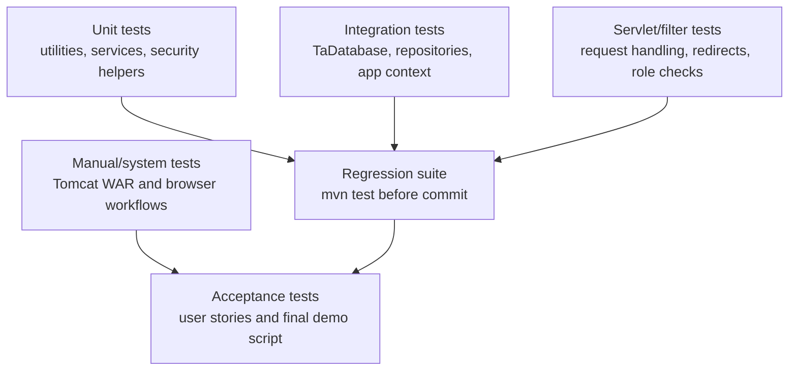

# 05 测试与质量保证

## 课程依据

Testing slides 要求从单元、集成、系统、验收等层次设计测试，并使用黑盒、白盒、边界值、等价类、回归测试等方法。Risk and Quality Management slides 要求把质量目标、质量门禁、缺陷跟踪和持续验证纳入项目管理。

| Slide | 本文档产物 |
|---|---|
| EBU6304_08 Testing | 测试层次、测试技术、测试计划、测试报告 |
| EBU6304_10 Project Management | 质量活动纳入迭代和交付计划 |
| EBU6304_12 Risk and Quality Management | 风险驱动测试、质量指标、缺陷控制 |
| EBU6304_13 Secure Software Development | 安全测试和滥用场景 |
| EBU6304_17 Revision | 需求-测试-设计追踪 |

## Quality Objectives

| Objective | Measure | Gate |
|---|---|---|
| Core workflows correct | TA apply, MO review, Admin manage users/skills/workload tests pass | `mvn test` must pass |
| Security regressions controlled | CSRF, upload, auth/role, AI consent tests pass | No known high-risk failing test |
| Persistence reliable | Repository and JSON store tests pass with temp data dirs | No data corruption or shared test state |
| Documentation aligned | Routes, roles, setup and AI behavior match current code | Docs review before final submission |
| Maintainability acceptable | Layering and review checklist followed | No new business logic directly in JSP or raw file writes |

## Test Strategy



## Automated Test Inventory

| Area | Representative tests | Purpose |
|---|---|---|
| Configuration/bootstrap | `AppConfigTest`, `DatabaseConfigTest`, `AppContextListenerIntegrationTest` | Data directory resolution and app startup behavior |
| Persistence | `TaDatabaseIntegrationTest`, `JsonTableStoreTest`, `JsonRepositoryIntegrationTest`, `JsonRepositoryDetailedTest` | JSON initialization, CRUD, atomic store behavior and repository rules |
| Authentication/accounts | `AuthServiceTest`, `TaAccountServiceTest`, `LoginServletTest`, `RegisterServletTest`, `PasswordUtilTest` | Login, registration, password hashing and session behavior |
| Recruitment services | `JobServiceTest`, `ResumeServiceTest`, `ApplicationServiceTest`, `MatchingServiceTest` | Job lifecycle, resumes, application transitions and matching |
| Admin workflows | `AdminServiceTest`, `AdminUsersServletTest`, `DbDemoServiceTest` | User management, audit/workload aggregation and database demo operations |
| Security helpers/filters | `AuthFilterTest`, `CsrfFilterTest`, `CsrfTokensTest`, `AiRequestGuardTest`, `EncodingFilterTest` | Request context, CSRF, AI consent and encoding |
| File handling | `ResumeFileUploadTest`, `ResumeFilePathsTest`, `ApplicationSubmissionFilesTest` | Upload validation, path safety and application snapshot creation |
| AI and messaging | `QwenAiServiceTest`, `AiMatchServletTest`, `MessageServiceTest`, `NotificationServiceTest` | AI parsing/fallback, AI endpoint behavior, messages and notifications |
| UI routing resilience | `PageLoadErrorServletTest`, servlet-specific tests | Key page models and error resilience |

## Requirement-To-Test Matrix

| Requirement | Test coverage | Remaining manual check |
|---|---|---|
| FR-01 Authentication and settings | `AuthServiceTest`, `LoginServletTest`, `RegisterServletTest`, `SettingsServletTest` | Login/logout in deployed Tomcat |
| FR-02 Resume management and upload | `ResumeServiceTest`, `ResumeFileUploadTest`, `ResumeFilePathsTest` | Upload from browser with accepted and rejected sample files |
| FR-03 Vacancy browse and apply | `ApplicationServiceTest`, `JobServiceTest` | TA portal navigation and application form rendering |
| FR-04 Offer handling | `ApplicationServiceTest`, `ApplicationDecisionServletTest` | TA accepting/declining from UI |
| FR-05 MO vacancy management | `JobServiceTest` | Create/edit/publish/cancel pages |
| FR-06 MO review and matching | `MatchingServiceTest`, `ApplicationSubmissionFilesTest` | MO application detail page and resume download |
| FR-07 Admin management | `AdminServiceTest`, `AdminUsersServletTest`, `DbDemoServiceTest` | `/admin/users`, `/admin/skills`, `/admin/audit`, `/admin/database`, `/workloads` |
| FR-08 AI assistance | `QwenAiServiceTest`, `AiRequestGuardTest`, AI servlet tests | Optional provider behavior with real key disabled/enabled |
| FR-09 Audit logging | Admin/service tests | Audit CSV export and search filters |
| FR-10 JSON persistence | Database and repository tests | Manual restart with same data directory |

## Black-Box Test Design

| Feature | Equivalence classes | Boundary values |
|---|---|---|
| Registration | valid TA data; duplicate email; invalid email; password mismatch | minimum password length; blank required fields |
| Login | valid active user; wrong password; inactive user; missing fields | repeated failed attempts should not expose password details |
| Resume upload | allowed PDF/DOC/DOCX; disallowed extension; spoofed MIME/signature; too large | exact max size; zero-byte file; filename with path separators |
| Job creation | valid dates and slots; missing title; deadline in invalid format; negative hours | slots = 1; weekly hours at accepted minimum/maximum |
| Application submit | open job; closed/cancelled job; duplicate application; missing resume | deadline just before/after submission time |
| Application decision | pending -> withdrawn; reviewing -> offer/reject; offered -> accept/decline; invalid repeated action | repeated accept/decline; action by wrong role |
| AI request | consent accepted; consent missing; provider configured; provider unavailable | empty prompt/resume; long input; malformed AI response |
| Admin user management | create TA/MO/Admin; edit; reset password; deactivate non-admin; protect admin | duplicate email; invalid role; blank password |

## White-Box Test Focus

| Code area | Branches to cover |
|---|---|
| `ApplicationService` | role checks, duplicate checks, each valid and invalid status transition |
| `MatchingService` | rule score calculation, required skill gaps, AI score fallback, workload adjustment |
| `JsonTableStore` | missing file initialization, malformed row rejection, save/delete/replace paths |
| `ResumeFileUpload` | extension/MIME/signature matrix and path normalization |
| `CsrfFilter` | safe methods, unsafe valid token, unsafe missing token, static asset bypass |
| `AiRequestGuard` | parameter consent, header consent, missing/negative consent |

## Security Test Plan

| Risk | Test method | Expected result |
|---|---|---|
| Unauthenticated access | Request protected route without session | Redirect to `/login` |
| Role bypass | TA requests admin route or MO-only decision | 403 or safe redirect/error |
| CSRF | POST without token | Rejected before state change |
| Upload bypass | Upload executable renamed as PDF | Rejected by MIME/signature checks |
| Path traversal | Filename contains `../` or absolute path | Stored under safe generated path or rejected |
| XSS | Submit HTML/JS in display fields | Rendered output escaped by JSP/JSTL conventions |
| Secret leakage | Search generated HTML/logs for `QWEN_API_KEY` | Key never appears client-side |
| AI consent bypass | AI POST without consent marker | Rejected and no provider call |

## Manual System Test Script

1. Start Tomcat with clean `TA105_DATA_DIR`.
2. Log in as `test@example.com` and verify TA dashboard, vacancies, resumes and applications.
3. Upload a valid resume and submit an application to an open vacancy.
4. Log in as `mo@example.com`, open the submitted application, start review and refresh match analysis.
5. Send an offer, then log in as TA and accept it.
6. Log in as `admin@example.com`, verify workloads, audit logs, users, skills and `/admin/database`.
7. Try a forbidden path as the wrong role and confirm access is denied.
8. Try an AI feature without consent, then with consent when configuration allows.

## Regression Gate

Every code-affecting commit should run:

```bash
mvn test
git diff --check
```

For documentation-only commits, `mvn test` is still required before final coursework submission because docs may change `.gitignore`, packaging assumptions or tracked assets.

## Test Report Template

| Field | Value |
|---|---|
| Date | 2026-05-19 |
| Build | local `main` |
| Command | `mvn test` |
| Result | Fill from command output |
| Total tests | Fill from command output |
| Failures/errors/skips | Fill from command output |
| Notes | Include any manual checks or known limitations |

## Quality Assurance Checklist

| Check | Status rule |
|---|---|
| All automated tests pass | Required |
| New route documented and covered by auth/role check | Required |
| Security-sensitive feature has negative tests | Required |
| Manual demo path exercised before final presentation | Required |
| Docs align with implementation and route names | Required |
| Known limitations recorded in risk register | Required |
