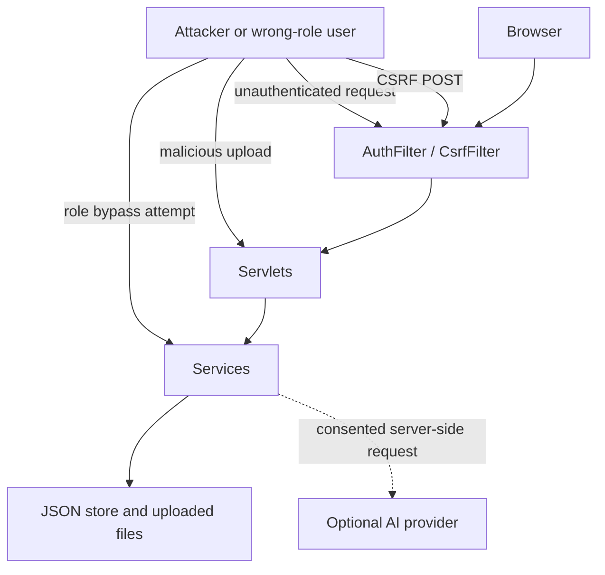

# 06 风险、安全与 AI 伦理

## 课程依据

EBU6304 强调软件质量不只来自功能完成，还来自风险识别、风险控制、质量管理、安全开发和伦理判断。对于 TA 招聘系统，安全和伦理尤其重要，因为系统处理学生简历、申请状态、工作量和 AI 辅助评价。

| Slide | 本文档产物 |
|---|---|
| EBU6304_10 Project Management | 风险登记、优先级、责任和跟踪 |
| EBU6304_11 Ethics and AI in Software Engineering | AI 辅助、隐私、公平性、透明度和人工责任 |
| EBU6304_12 Risk and Quality Management | 风险概率/影响、质量控制、缓解计划 |
| EBU6304_13 Secure Software Development | 威胁建模、认证授权、输入校验、secret 管理 |
| EBU6304_16 AI for Software Development | AI 作为开发和产品能力时的可靠性边界 |

## Risk Register

| ID | Risk | Probability | Impact | Current mitigation | Owner | Priority |
|---|---|---|---|---|---|---|
| R-01 | 未授权用户访问 TA、MO 或 Admin 数据 | 中 | 高 | `AuthFilter`、Servlet/Service 角色和所有权检查、测试 | Backend | 高 |
| R-02 | CSRF 导致用户在不知情时提交状态变更 | 中 | 高 | `CsrfFilter`、JSP token 注入、CSRF 测试 | Backend | 高 |
| R-03 | 恶意文件上传或路径穿越 | 中 | 高 | 扩展名、MIME、签名、大小校验，路径限制 | Backend | 高 |
| R-04 | AI 请求泄露隐私或被误解为自动录用决定 | 中 | 高 | 显式同意、审计、最小记录、人工最终决策 | Product/Backend | 高 |
| R-05 | JSON 文件损坏或部分写入 | 低 | 高 | 原子写入、读写锁、corruption exception、测试 | Backend | 高 |
| R-06 | 多用户并发或多 Tomcat 实例导致文件数据竞争 | 中 | 中 | 文档明确单 JVM 课程部署假设 | Maintainer | 中 |
| R-07 | 需求和实现不一致导致评审无法追踪 | 中 | 中 | 需求矩阵、文档索引、traceability 文档 | Team | 中 |
| R-08 | 测试覆盖偏向 happy path | 中 | 中 | 边界/负向/安全测试清单和回归门禁 | QA | 中 |
| R-09 | API key 或运行数据被误提交 | 中 | 高 | `.gitignore` 忽略大文件、data、archives、slides，secret 搜索 | Maintainer | 高 |
| R-10 | UI 中输出未转义引发 XSS | 低 | 高 | JSP/JSTL 输出转义约定，静态搜索和人工审查 | Frontend/Backend | 中 |
| R-11 | 工作量计算不准确影响公平分配 | 中 | 中 | `AdminService` 聚合测试、人工审查建议 | Backend | 中 |
| R-12 | 远端 AI 不可用影响核心流程 | 中 | 中 | 规则匹配兜底；AI 可选 | Backend | 中 |

## Security Threat Model

| Threat | Attack example | Existing control | Additional recommendation |
|---|---|---|---|
| Spoofing | Access portal with no session | `AuthFilter` login redirect | Use HTTPS and secure cookies in production |
| Elevation of privilege | TA posts to admin route | Role checks in admin servlets/services | Add browser E2E role tests |
| CSRF | Hidden form submits application decision | `CsrfFilter` for unsafe methods | Keep token on every new form/fetch |
| Tampering | Modify JSON file while app runs | Atomic writes and corruption checks | Do not edit data files manually during runtime |
| Information disclosure | Download another TA's resume snapshot | Ownership checks and controlled file helpers | Add specific negative download tests if route expands |
| Malicious upload | Executable disguised as PDF | MIME/signature/size validation | Virus scanning would be needed for production |
| Repudiation | Admin changes user without record | Audit logs for high-impact actions | Periodic audit export review |
| Secret leakage | Qwen key committed or rendered | Env/system property only; ignore `API-KEY` | Run secret scan before submission |
| Prompt injection / AI misuse | Resume asks AI to ignore instructions | AI output is advisory and constrained | Show user-facing warnings and keep final decision human |

## Authentication And Authorization Controls

| Control | Current evidence | Review expectation |
|---|---|---|
| Session-based authentication | `LoginServlet`, `AuthService`, `AuthFilter` | Protected route requires valid `currentUser` |
| Session hardening | Login creates fresh session | Session id rotation occurs after login |
| Role-based access | `UserRole` and route/service checks | TA, MO, Admin cannot cross sensitive boundaries |
| Ownership checks | MO can review own vacancies; TA can manage own applications/resumes | Tests cover wrong-owner cases |
| Admin-only database page | `DbDemoServlet` route `/admin/database` and `requireAdmin` | Entry is not public and should stay under `/admin` |

## Data Protection

| Data type | Sensitivity | Protection |
|---|---|---|
| Password hash | High | Hash through `PasswordUtil`; plain password only transient |
| Resume files | High | Stored under configured data dir; validated on upload; snapshot for application review |
| Application status | Medium/high | Role and ownership checks; audit where relevant |
| Workload records | Medium | Admin/MO context controls and workload aggregation |
| Audit logs | Medium | Admin search/export; avoid storing full AI prompts/outputs |
| AI inputs/outputs | High | Explicit consent, minimal audit metadata, optional provider |

## AI Ethics Policy

| Principle | Policy for QM HIRE | Current evidence |
|---|---|---|
| Transparency | Users must know when AI assistance is used | AI UI and guard require explicit consent |
| Human accountability | MO makes final offer/reject decisions | AI methods are recommendation/advice only |
| Privacy | Send only necessary data and do not persist complete prompts/model outputs in audit logs | `AiRequestGuard`, `AI_REQUEST` audit metadata |
| Fairness | AI score must not be the only basis for ranking or hiring | `MatchingService` combines rule-based logic and workload context |
| Contestability | Users and MO can inspect underlying application data and make manual decisions | Application detail, resume snapshot and status workflow |
| Reliability | AI provider failures must not block core recruitment | Rule-based fallback and optional AI configuration |
| Security | API key stays server-side | `QwenAiService` reads env/system properties |

## Secure Development Checklist

| Item | Required action |
|---|---|
| New public route | Confirm it is intentionally unauthenticated; otherwise protect with `AuthFilter` and role checks |
| New POST/PUT/DELETE action | Include CSRF token and negative test |
| New file operation | Normalize path, restrict to data dir, validate type/size, test traversal attempts |
| New admin action | Check Admin role and append audit log where state changes |
| New MO action | Check MO role and job ownership |
| New TA action | Check TA role and resource ownership |
| New AI action | Require consent, log `AI_REQUEST`, avoid storing full sensitive prompt/output |
| New config/secret | Read server-side, document env var, add ignore/secret scan consideration |

## Quality Management Plan

| Activity | Frequency | Evidence |
|---|---|---|
| Automated regression tests | Before commit and final push | `mvn test` output |
| Static search for high-risk patterns | Before final submission | Review searches in implementation doc |
| Documentation alignment | Before final submission | `docs/08-coursework-documentation-traceability.md` |
| Risk review | At milestone/final review | Risk register updates |
| Security review | Before enabling new endpoint or upload/AI feature | Checklist and tests |
| Manual demo rehearsal | Before presentation/video | User/deployment doc script |

## Known Limitations

| Limitation | Impact | Accepted because | Future improvement |
|---|---|---|---|
| JSON file persistence is single-JVM oriented | Not production-safe under multi-node deployment | Coursework demo scope and no external DB constraint | Replace repository implementation with RDBMS |
| No full browser E2E suite | Some JSP navigation regressions may be manual-only | Broad service/filter/servlet tests exist | Add Playwright/Selenium tests |
| No production email/password recovery | Users rely on admin password reset | Avoids insecure public reset flow in coursework scope | Add tokenized email reset with expiry |
| No enterprise identity provider | Demo accounts and local auth only | Course deployment simplicity | Integrate SSO/OAuth for production |
| AI fairness not externally audited | AI ranking may carry provider bias | AI is optional/advisory and final decisions are human | Add bias checks and explainability review |
